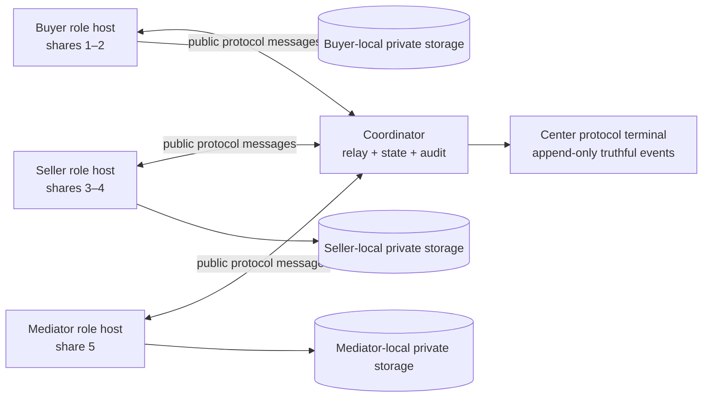
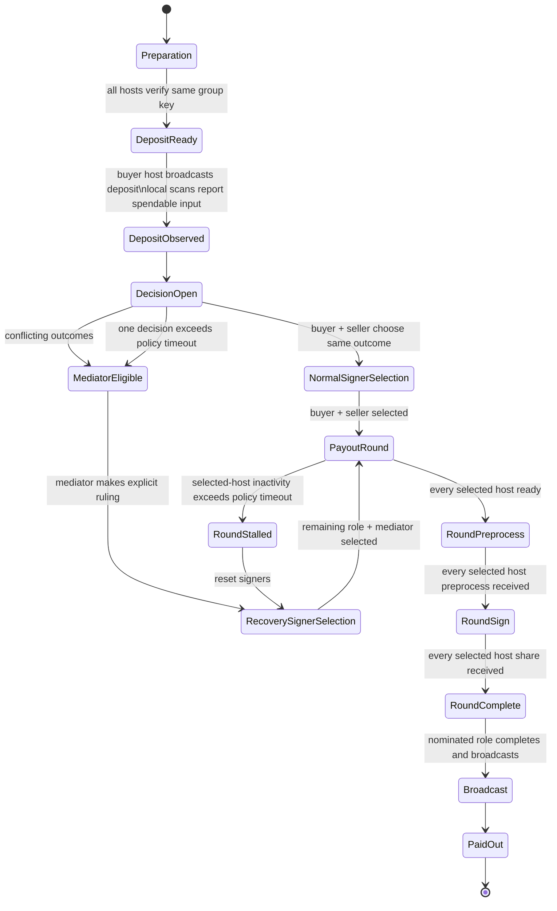

# Production-Faithful FROST Role-Host Architecture Proposal

## Recommendation

The recommended end state is a **role-isolated FROST escrow system**. The buyer, seller, and mediator each operate a local signer runtime that owns its own private material. The coordinator is an authenticated relay, workflow-state store, and audit/terminal publisher; it is **not** a holder of buyer, seller, mediator, wallet, or FROST threshold secrets.

This architecture preserves the demonstration’s real 3-of-5 allocation while making the visible behavior truthful:

| Role | FROST shares | Private material retained locally | Coordinator receives |
|---|---:|---|---|
| Buyer | 1–2 | DKG secrets, threshold keys, wallet material, role backup | Public DKG key, participation, readiness, preprocess, signature share, public transaction status |
| Seller | 3–4 | DKG secrets, threshold keys, merchant wallet material, role backup | Public DKG key, participation, readiness, preprocess, signature share, public transaction status |
| Mediator | 5 | Delayed DKG secret, derived threshold key, role backup | Public DKG key, delayed verification result excluding secret material, readiness, preprocess, signature share |
| Coordinator | 0 | **No role secrets** | Public context, decision records, selected signer set, public protocol artifacts, transaction IDs, policy timestamps, redacted audit |

> **Security boundary:** the FROST calls remain real, but `participate()`, `verify()`, `preprocess()`, `sign()`, `complete()`, and wallet broadcast run in a role runtime that owns the relevant secret. The coordinator only transports permitted protocol artifacts.

## Why This Is the Correct End State

The existing implementation already uses real FROST primitives. The problem is not a missing FROST capability; it is the current process boundary. Buyer and seller private material is created, persisted, and used by the coordinator, while the mediator alone is isolated. That produces real cryptographic output, but it does not demonstrate a production-faithful custody model.

The existing isolated mediator host proves the required primitive is available: a role process retains its secret locally, accepts public DKG context, participations, an unsigned transaction, and peer preprocesses, and returns only a preprocess and signature share. Buyer and seller hosts must follow the same model.

The XMRBazaar guide is the behavior model rather than a drop-in FROST implementation. It separates preparation, deposit, decision, and payout; makes signer selection explicit; requires both selected signers for payout; and handles disagreement or a missing trader through mediator recovery. This proposal adapts those semantics to a **3-of-5 FROST threshold** rather than XMRBazaar’s 2-of-3 Monero multisig model.[1]

## Architecture Diagram



The first local demonstration may use three loopback hosts, because the product is local and offline. The production-equivalent deployment replaces the buyer and seller loopback hosts with browser-local workers or local companion clients. The public message contract remains the same.

## Role-Host Message Contract

Every relayable message has a durable envelope. The coordinator stores and displays its public metadata, validates message ordering, and relays it to the selected roles. It must reject messages that contain private DKG secrets, threshold keys, wallet spend/view keys, or raw FROST backups.

| Envelope field | Purpose |
|---|---|
| `protocol_version` | Versioned compatibility boundary for future upgrades |
| `escrow_id` | Immutable escrow/session identifier |
| `round_id` | Identifies one payout attempt; resets create a new round |
| `message_id` | Idempotency key preventing duplicate processing |
| `from_role` | `buyer`, `seller`, or `mediator` |
| `type` | Defined protocol action, such as `decision.request` or `frost.share` |
| `created_at` | Policy/audit timestamp |
| `payload` | Only public or relayable protocol artifact for the specified type |
| `payload_hash` | Audit correlation without exposing sensitive contents |

### Setup Messages

| Type | Sender | Relayable payload | Private operation performed locally |
|---|---|---|---|
| `setup.join` | Every role | Role identity and public DKG key | Generate local DKG secret |
| `setup.participation` | Buyer and seller | FROST participation string | Run `participate()` using local DKG secret |
| `setup.verified` | Buyer and seller | Group key, participant index, public verification status | Run `verify()` and retain threshold key locally |
| `setup.mediator-ready` | Mediator | Public key and readiness | Preserve delayed secret; no threshold key is derived yet |
| `setup.scan-ready` | Buyer and seller | Non-secret address/status | Derive view-pair and configure local wallet scan state |

The coordinator can display the public group key and each host’s status only after it receives the corresponding real response. It must not mark a role complete because a local server-side step happened on its behalf.

### Decision Messages

| Type | Sender | Meaning | Does it move funds? |
|---|---|---|---|
| `decision.request` | Buyer or seller | Requests `release_to_seller` or `refund_to_buyer` | No |
| `decision.accept` | Counterparty | Accepts the same outcome | No; this selects the normal signer set |
| `decision.mediator-ruling` | Mediator | Chooses an outcome after policy eligibility | No; this selects a recovery signer set |
| `decision.reset` | Eligible remaining signer | Invalidates an expired payout round | No; creates a new signer-selection round |

### Payout-Round Messages

| Type | Sender | Coordinator may store/display | Role-local operation |
|---|---|---|---|
| `round.selected` | Coordinator | Selected roles, destination class, round ID, deadline | None |
| `round.ready` | Each selected role | Readiness flag and local wallet sync status | Open/sync role-local wallet |
| `frost.preprocess` | Each selected role | Preprocess string and participant index | Create a local `MultiSigTxSigner`, call `preprocess()` |
| `frost.share` | Each selected role | Signature share and participant index | Call `sign()` after all required preprocesses arrive |
| `frost.completed` | Nominated completion role | Signed transaction hash or safe correlation value | Call `complete()` using its own signer state |
| `tx.broadcast` | Nominated broadcast role | Transaction ID and network observation | Broadcast signed transaction with a role-local wallet |
| `round.failed` | Any selected role | Non-sensitive failure code | Preserve local diagnostic; never publish secrets |

The same role that created the `MultiSigTxSigner` state must retain it until `complete()` or expiry. This is why each round has a durable ID and why a reset creates a **new** round rather than attempting to reuse old preprocess data.

## Exact 3-of-5 Signer Rules

The threshold is **3**, not 2. Any allowed path must have at least three shares.

| Situation | Outcome | Signer set | Share count | Mediator secret |
|---|---|---|---:|---|
| Buyer and seller agree | Release to seller | Buyer 1–2 + seller 3–4 | 4 of 5 | Never loaded |
| Buyer and seller agree | Refund to buyer | Buyer 1–2 + seller 3–4 | 4 of 5 | Never loaded |
| Mismatched decisions | Mediator rules refund | Buyer 1–2 + mediator 5 | 3 of 5 | Loaded only in mediator host at payout |
| Mismatched decisions | Mediator rules release | Seller 3–4 + mediator 5 | 3 of 5 | Loaded only in mediator host at payout |
| Buyer or seller absent after policy timeout | Mediator selects release or refund | Remaining role’s two shares + mediator 5 | 3 of 5 | Loaded only in mediator host at payout |
| Selected signer disappears mid-round | Preserve decided outcome; reset signers after policy timeout | Remaining selected role’s two shares + mediator 5 | 3 of 5 | Loaded only for the replacement round |

The final two rows correct a limitation in the current prototype. Recovery must support **all four combinations** of remaining signer and destination: buyer+mediator release, buyer+mediator refund, seller+mediator release, and seller+mediator refund. The signer set and the transaction destination are independent choices. Restricting buyer+mediator to refund or seller+mediator to release would not fully model the intended recovery semantics.

## State Machine



## Center Protocol Terminal

The center column should become the primary source of truth. It should have a terminal visual language—monospace, chronological commands/responses, live connection state, explicit waiting conditions, and a fixed per-round header—but it must be driven only by received host messages and coordinator state transitions.

For a normal release, the visible sequence is:

```text
[decision] buyer request: release_to_seller
[decision] seller accept: release_to_seller
[quorum] selected: buyer[1,2] + seller[3,4] = 4/3
[round:r-42] buyer host wallet sync: ready
[round:r-42] seller host wallet sync: ready
[round:r-42] buyer host preprocess: participant 1 received
[round:r-42] buyer host preprocess: participant 2 received
[round:r-42] seller host preprocess: participant 3 received
[round:r-42] seller host preprocess: participant 4 received
[round:r-42] buyer host signature shares: 1,2 received
[round:r-42] seller host signature shares: 3,4 received
[round:r-42] completion host: seller
[broadcast] txid: <real fakechain transaction ID>
```

If a role is unavailable, the terminal must display `waiting for seller host`, `policy timeout not yet eligible`, or `round stalled; reset signers eligible at …`. It must not silently substitute a coordinator action or skip to broadcast.

## User Interface Structure

| Area | Purpose | Must never claim |
|---|---|---|
| Top warning | Role-specific FROST backup reminder and accurate custody disclosure | Browser-only storage if a local host actually owns the material |
| Buyer card | Buyer host connection, local backup readiness, deposit action, decision request, role status | That the buyer signed if its host has not produced a share |
| Center terminal | Primary protocol ledger and active round status | A synthetic step that has no matching host/coordinator event |
| Seller card | Seller host connection, merchant destination, decision request, role status | That seller alone can execute a normal payout |
| Mediator card | Public key, host status, policy eligibility, ruling controls, recovery reset role | Availability before a mismatch, policy timeout, or stalled-round eligibility |

## Policy and Demonstration Timing

The production policy should state **7 days** for an unanswered decision and an inactive selected signer, following the Bazaar guidance.[1] The regtest demonstration can make that observable with an explicit configuration such as:

| Environment | Policy label | Actual configured delay |
|---|---|---:|
| Production | `Mediator eligibility after 7 days without response` | 7 days |
| Recording demo | `7-day policy simulated for regtest recording` | 60 seconds or other displayed value |

The reduced recording delay must never be described as a production timeout. The terminal and audit should store both the policy class and the configured simulation delay.

## Incremental Implementation Sequence

The first implementation must prove the security boundary before expanding the UI policy surface.

| Milestone | Deliverable | Acceptance evidence |
|---|---|---|
| 0 | Finalize this protocol contract and redaction rules | Approved state/message tables; no code change |
| 1 | Buyer and seller loopback role hosts | Coordinator cannot read buyer/seller secret files or threshold keys; host health/status visible |
| 2 | Isolated-role setup and backup exports | Same group key verified by all roles; private material remains local to each host |
| 3 | Buyer+seller happy-path payout | Four host-originated preprocesses/shares, real fakechain payout txid, mediator absent |
| 4 | Terminal-driven decision and round UI | Every displayed terminal step correlates to an immutable protocol event |
| 5 | Mismatch and timed-out decision recovery | Real buyer+mediator and seller+mediator paths for both release and refund destinations |
| 6 | Stalled-round timeout and Reset signers | Expired round cannot reuse preprocesses; replacement round completes with remaining party + mediator |
| 7 | Browser-local production adapter | Buyer/seller loopback host contract implemented by browser-local worker/client while preserving the same relay protocol |

## Approval Decision

Approve this proposal if the project should now replace coordinator-held buyer/seller signing with the role-host architecture in Milestones 1–3 first. The initial executable target is a buyer+seller happy path whose private FROST material never enters coordinator storage or memory, whose terminal shows four real host contributions, and whose mediator process is provably absent.

## Reference

[1] User-supplied **XMRBazaar Escrow Guide**, `pasted_content_4.txt`, especially its four-stage process, decision rules, payout sequence, missing-trader recovery, and Reset Signers description.
